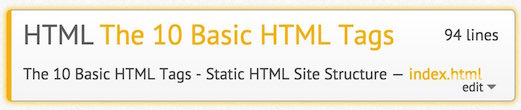
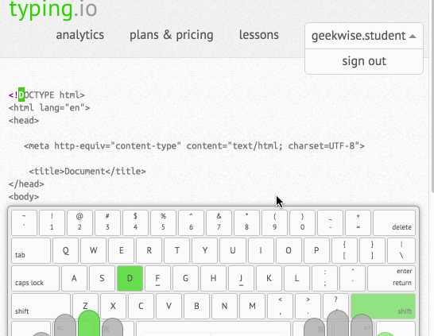

--
<h1 align='center' style='
background-color:#dbdbdb;'>
Static HTML5/CSS3
</h1>
***

### Requirements:
* A possitive mindset
> We are taking part in creating the greatest equalizer in human history.
> **The Internet**
 
* Your laptop (apple/win/linux).
* Chrome Web Browser - Developer Mode.
* Brackets - (Adobe & Opensource | apple/win/linux)

# 10 HTML tags

### Goal:
> Ability to sructure information for the Internet.

The outcome is to learn the basic 10 tags you will use when creating a static HTML file.

 * HTML TAGS
	- 1. `<h1> - <h6>` Heading
	- 2. `
` Paragraph
	- 3. `<b>` Bold
	- 4. `<a>` Anchor
	- 5. `<ul>` Unordered List
	- 6. `<li>` List Item
	- 7. `<ol>` Ordered List
	- 8. `` Image
	- 9. `<html>` HTML
	- 10.	`<body>` Body

-- 
### Demo Site:
<http://geekwise.github.io/static/>

-- 

These 10 HTML Tags will help you format and orgainze information for the Internet.
Even though it looks like a lot to learn, they are easy to remember and they all work the same way.

#Assetment 1:

- 1: Setup Google Account For *Just* This Course
 - `email name: geekwise.firstName.LastName@gmail.com`

- 2: Login To [![your alt][typingio_logo]](http://www.typing.io)

[typingio_logo]:images/typingio_logo.jpg?raw=true

	- Password Will Be in Your Email 

- 3: Select The 10 Basic HTML Tags Lesson
	- 

- 4: Practice Typing the Code to Learn and Memorize the 10 Basic Html Tags
 - 

## Creating Clean Code

##The Keyboard
Our primary tool of our trade.
There are no perfect programmers.
So we practice perfection with daily coding.
Typing skills are as fundamental as it gets for programmers.

> Typing practice doesn't matter and is dumb

Yes it's kinda lame, but that's how development is.
A "simple" website can be filled with thousands of lines of code.
Code is made of tiny things that can have large consequences.
Like, say, a single misplaced *semicolon* `;`

---

* [ ] `body{background-color:lightSeaGreen};`
* [x]  `body{background-color:lightSeaGreen;}`

* [ ] `<b>Bold Text</>`
* [x]  `<b>Bold Text</b>`

---
